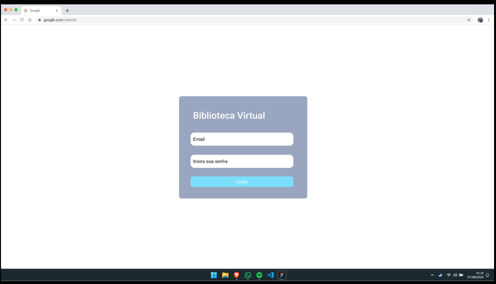
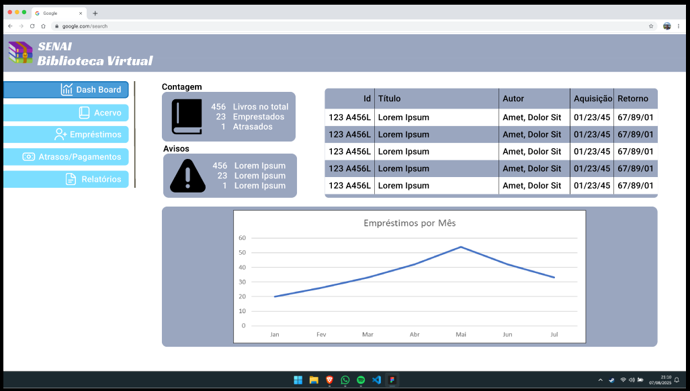
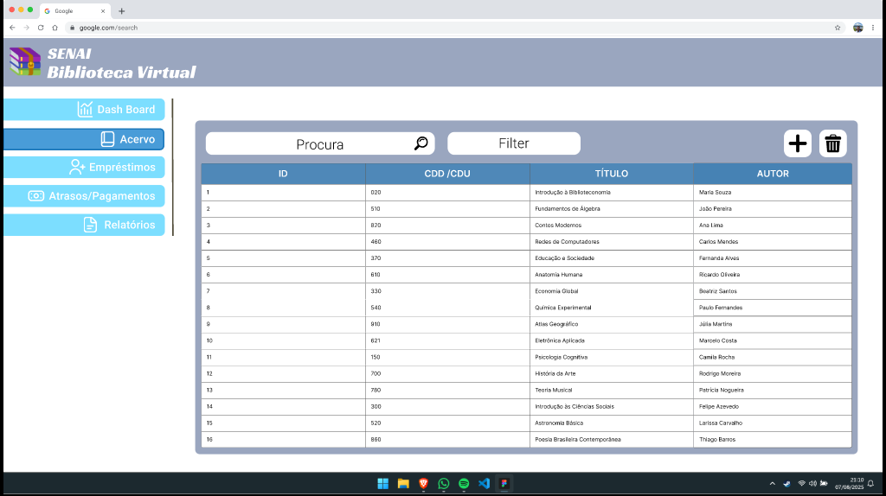
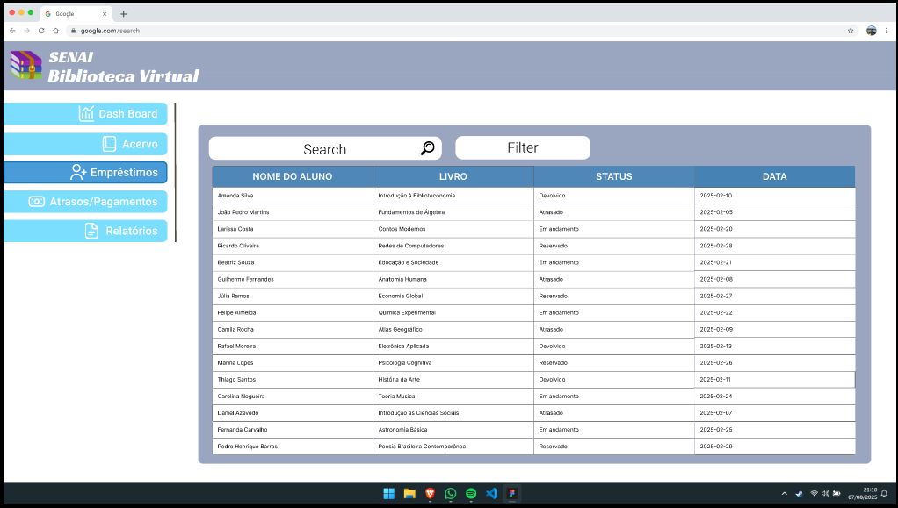
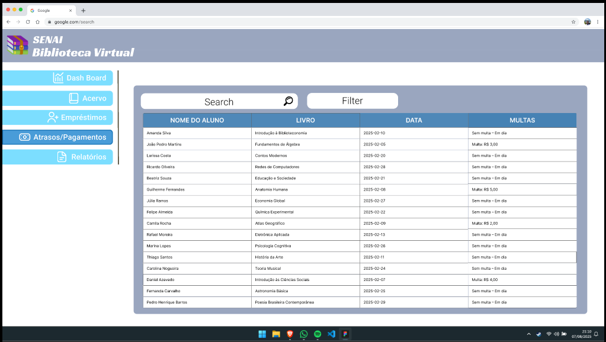
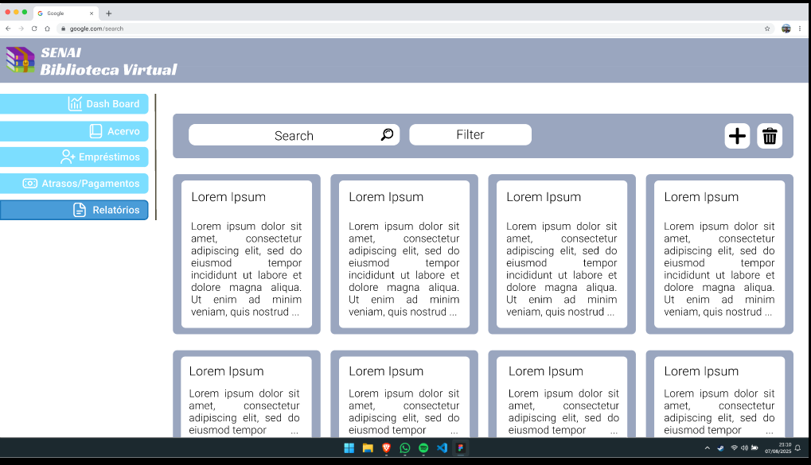

# Library-Interface
Interface para os bibliotecários

## Tela de login

## Dashboard

## Acervo

## Empréstimos

## Atrasos / Pagamentos

## Relatórios

[Abrir protótipo no Figma](https://www.figma.com/proto/MmMfYzk8pks8J2KWb7PVpI/Untitled?node-id=422-2366&p=f&m=draw&scaling=scale-down&content-scaling=fixed&page-id=0%3A1&starting-point-node-id=1%3A2&t=C1LquOkhkrJ7t2he-1)
